# Phase III: Software Design and Modeling

---

## 1. Software Architecture

### System Architecture

**Urban Issue Tracker — System Architecture**

The system follows a client-server architecture. The React frontend communicates with the Flask backend through a REST API via a shared `api.js` HTTP client. The backend handles all business logic, enforces role-based access, and reads/writes from PostgreSQL.

---

**1. Citizen Reports an Issue**
- Citizen fills out the report form on the React frontend (`SubmitReport` component)
- Request goes to the Flask backend (`routes/reports.py`)
- Backend checks JWT token via `utils/authz.py` to confirm the user is authenticated
- Backend validates the report data and writes a new row to the `reports` table in PostgreSQL
- Backend triggers a notification entry in the `notifications` table
- Frontend confirms submission and redirects the citizen to MyReports

**2. Citizen Views Their Reports / Public Map**
- Citizen opens MyReports or the PublicTracking/Map page (Leaflet.js renders the map)
- Request goes to `routes/reports.py`
- Backend queries the `reports` table filtered by the citizen's user ID (or all public reports for the map)
- Backend sends the report list with statuses back to the frontend
- Frontend displays reports with status badges (`StatusBadge` component)

**3. Staff Reviews and Updates a Report**
- Staff member logs into the staff dashboard (React frontend)
- Frontend requests all reports from `routes/reports.py`
- Backend checks JWT token and confirms the role is `staff` via `utils/authz.py`
- Backend queries the `reports` table and returns all reports
- Staff selects a report and updates the status (e.g. In Progress → Resolved)
- Backend validates the status transition (lifecycle rules in `routes/reports.py`), checks SLA deadlines via `utils/reporting.py`, updates the `reports` table, and writes a new notification to the `notifications` table
- Frontend refreshes the dashboard with the updated status

**4. Admin Manages Staff Accounts**
- Admin logs in and opens the admin panel (React frontend)
- Frontend requests staff data from `routes/admin.py`
- Backend checks JWT token and confirms the role is `admin` via `utils/authz.py`
- Backend queries the `users` table filtered by `role = staff`
- Admin can create, disable, or reset a staff account — backend writes the change to the `users` table
- Frontend confirms the update in the admin panel

**5. Admin Views Analytics and Exports Data**
- Admin opens the analytics section of the admin panel
- Frontend requests stats from `routes/admin.py`
- Backend queries the `reports` table (counts by status, category, date, etc.) and returns aggregated data
- Admin can export — backend generates a CSV or PDF and returns it for download
- Frontend displays charts and download links

**6. Login / Logout (All Roles)**
- User submits credentials on the Login page
- Request goes to `routes/auth.py`
- Backend queries the `users` table, verifies the hashed password using bcrypt, and issues a JWT token
- Token is stored client-side and attached to every subsequent request
- On logout, the token's JTI (unique JWT ID) is added to the `token_blocklist` table so it can never be reused
- Every protected request is checked against the blocklist in `utils/authz.py`

---

### Component Diagram (UML)

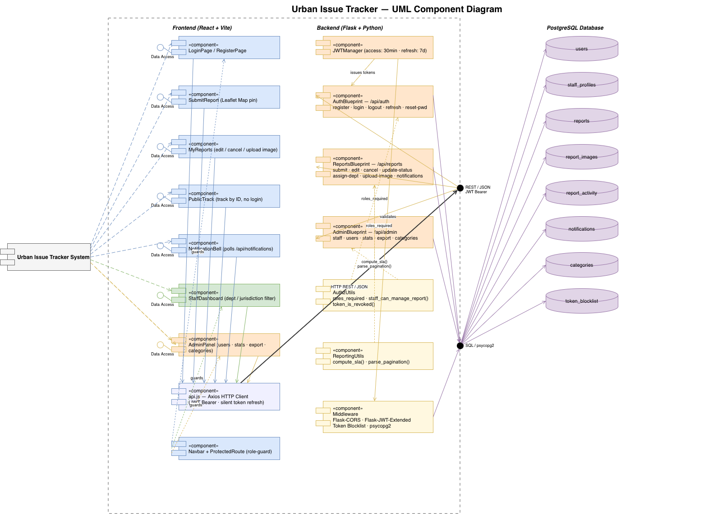

---

## 2. Detailed Design

### Class Diagram

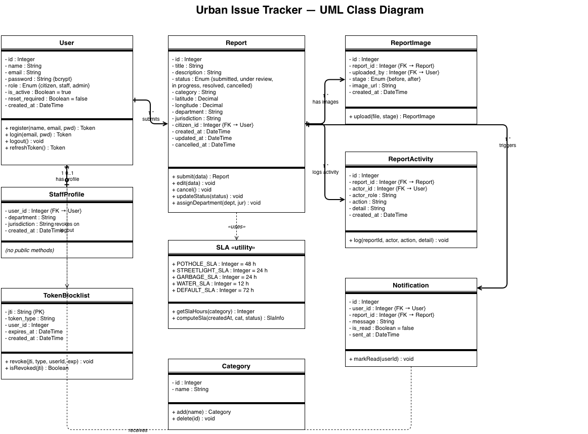

---

### Sequence Diagrams

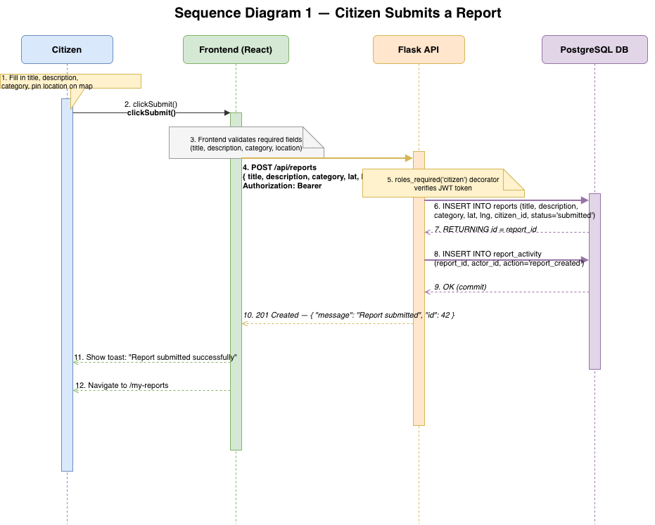

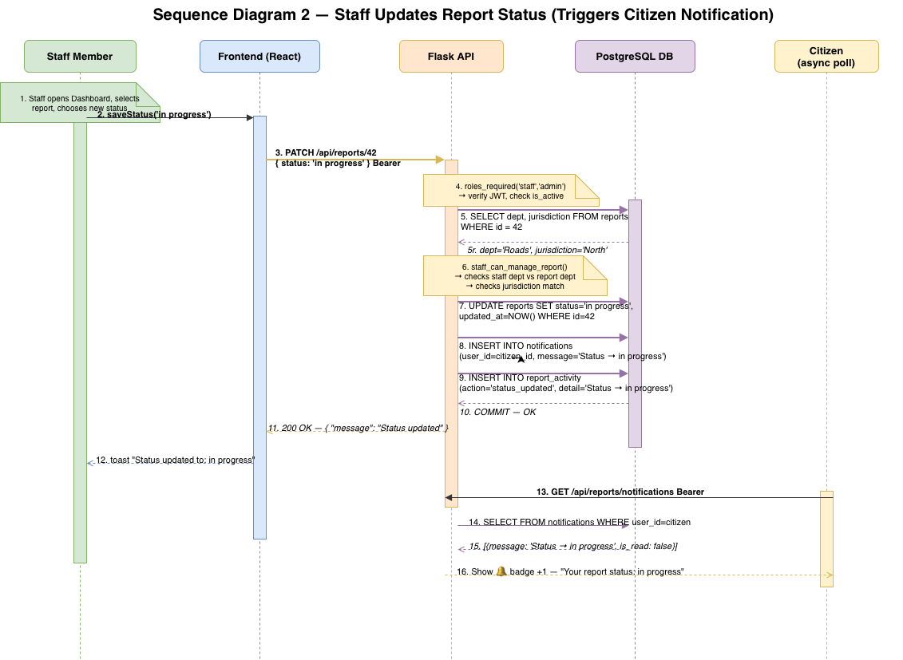

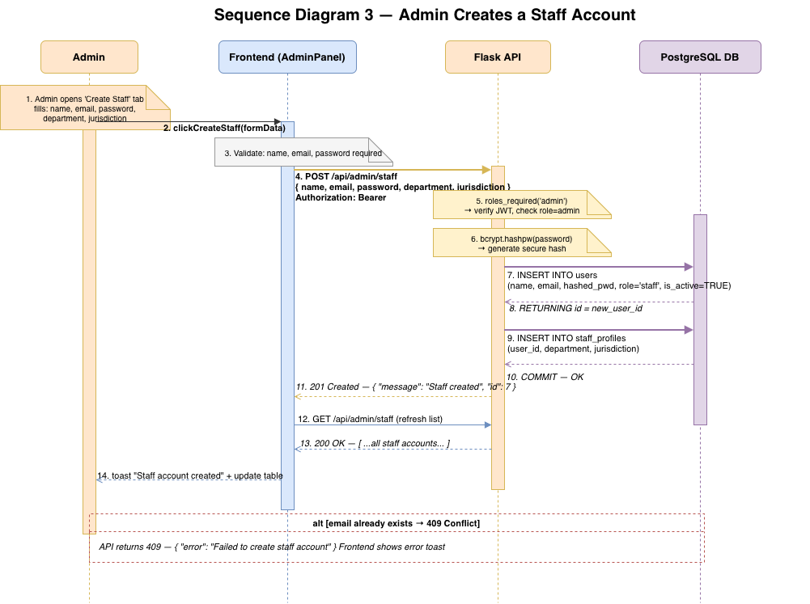

---

## 3. Modeling

### Use Case Diagram

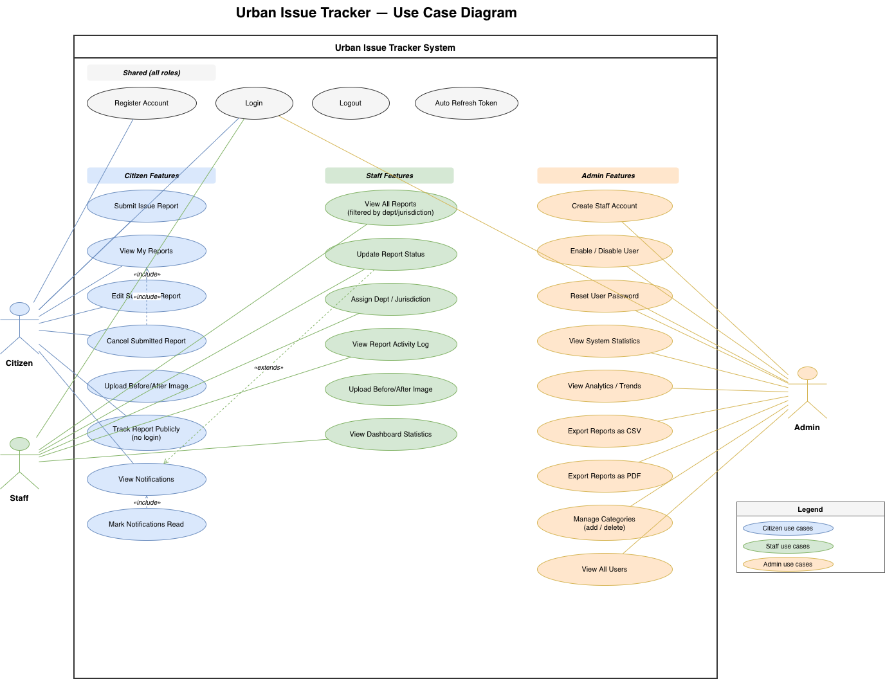

---

### Activity Diagrams

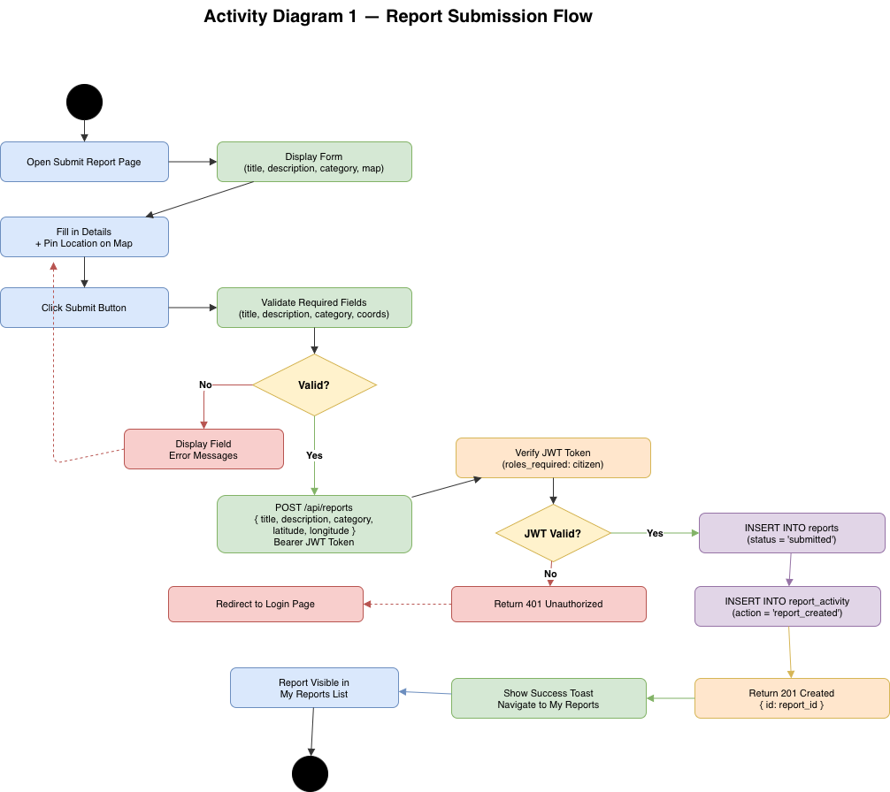

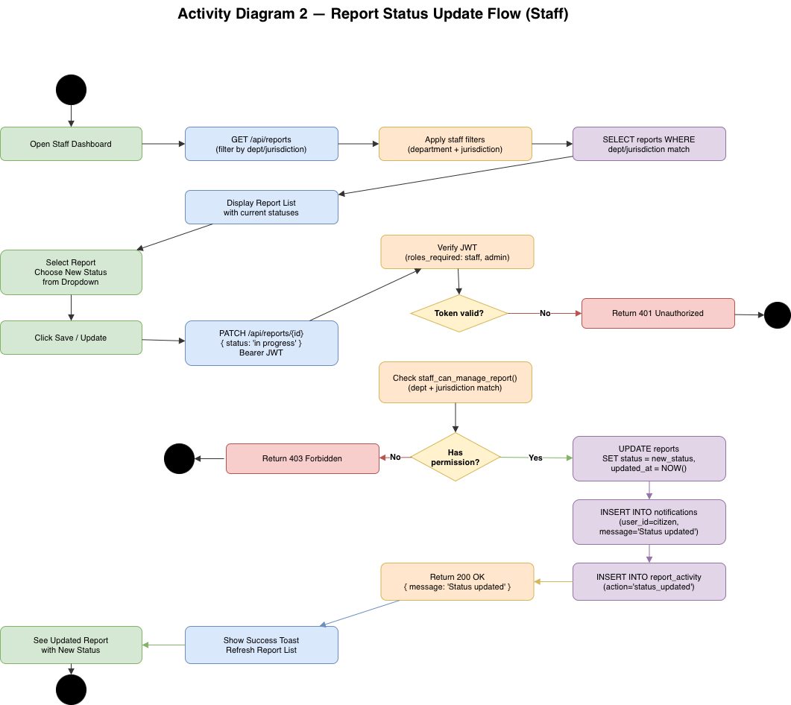

---

### State Diagrams

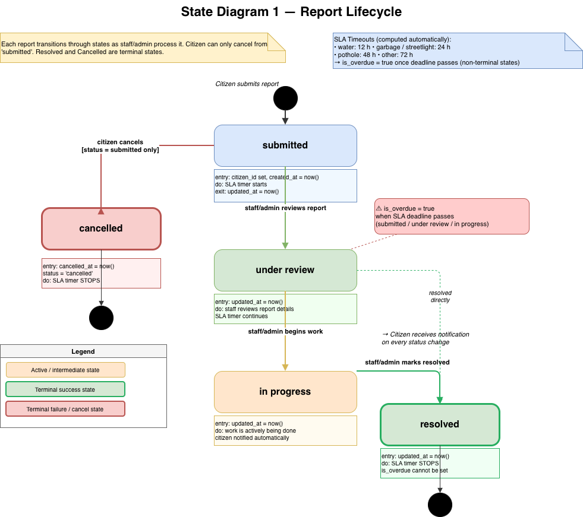

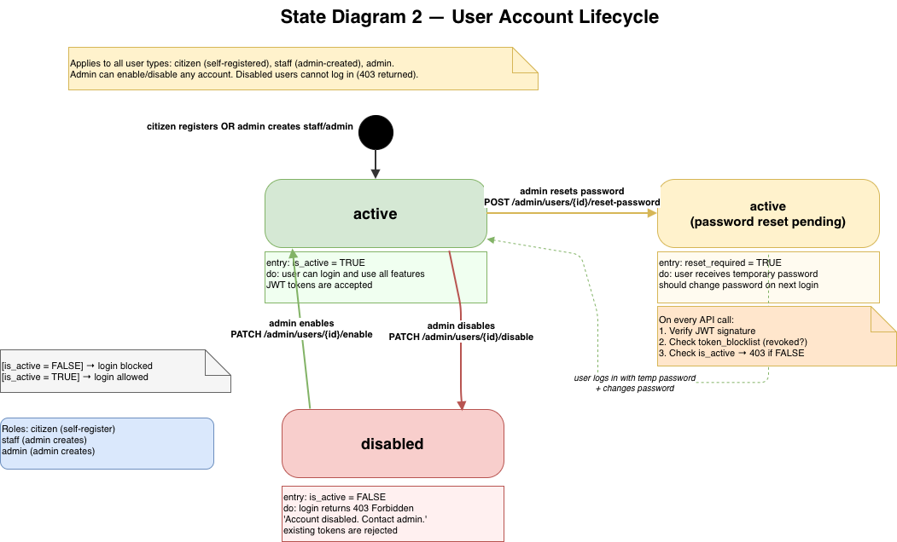

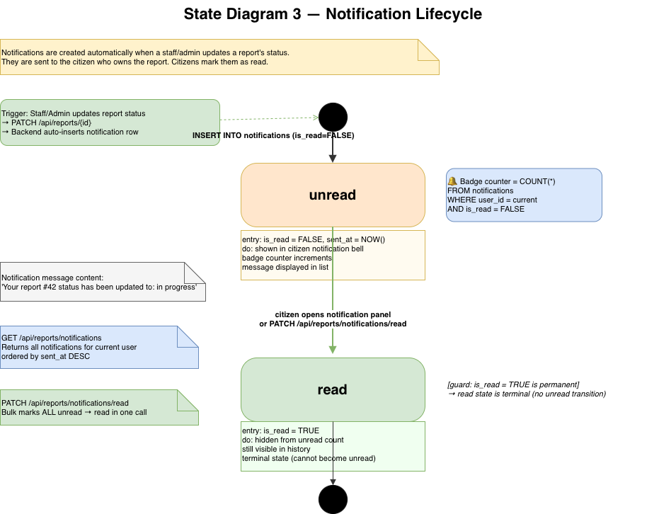

---

*Urban Issue Tracker · Group 2D · Software Engineering · 2026*
